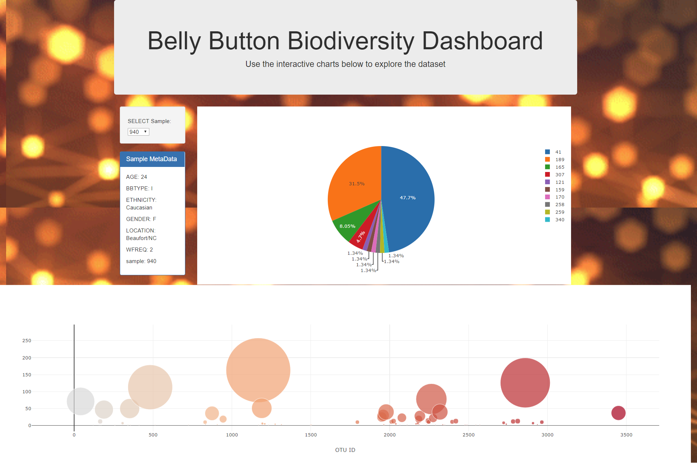

# Belly Button Biodiveristy

## Background
The belly button is one of the habitats closest to us, and yet it remains relatively unexplored. In January 2011, Belly Button Biodiversity to investigate the microbes inhabiting our navels and the factors that might influence the microscopic life calling this protected, moist patch of skin home was launched. This project is to create an interactive dashboard to explore the amazing diversity of cultured bacteria from the participant's belly buttons!

 [Belly Button Biodiversity DataSet](http://robdunnlab.com/projects/belly-button-biodiversity/).

## Technologies/Frameworks/Databases used
* Plotly.js: To build interactive charts for the dashboard
* Python Flask API:
* SQLite database
* HTML/CSS/JavaScript

## Snapshot of the webpage
 

